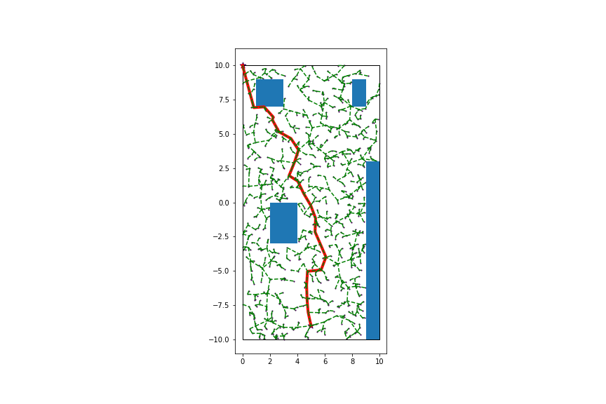
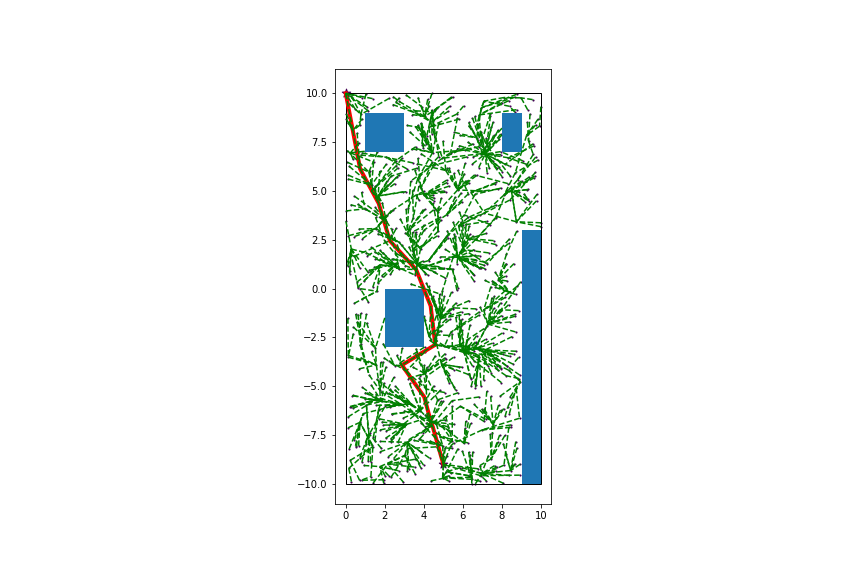

# mptool

The toolkit for motoin planning tasks in robotics. 

## Dependencies

- Boost >= 1.69
- Jupyter

Package used for unit test:
- [GUnit](https://github.com/cpp-testing/GUnit) 

## Rapidly exploring random tree

- [x] RRT

    

- [x] RRT*

    

- [] RRT-Connect

## Model Predictive Control

- [] Chance-constraint MPC
